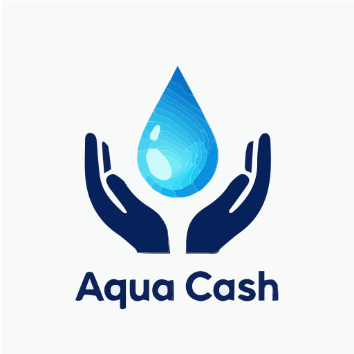

# Aqua Cash (AQU) - Official Repository

Welcome to the official GitHub repository for Aqua Cash (AQU). This repository contains the smart contract and documentation for the AQU token operating on the BNB Smart Chain (BSC).

## 🌊 About Aqua Cash (AQU)

Aqua Cash (AQU) is a utility token designed with a focus on **transparency**, a **simple token structure**, and **verifiable on-chain information**. We aim to build trust and provide clarity for all holders and potential investors.

## 🚀 Key Project Facts

*   **Total Supply:** 28,000,000 AQU
*   **Buy Tax:** 0%
*   **Sell Tax:** 0%
*   **Tokens Locked:** 10,000,000 AQU (until May 2027)
*   **Ecosystem Reward Pool:** 3,000,000 AQU (distributed over 4 years)
*   **Contract Address:** `0x1Ca2fcD10477604F291525c54c65a6B3E7485303`
*   **Network:** BNB Smart Chain (BSC)

## ⛓️ Smart Contract & Tokenomics

The AQU smart contract is deployed on the BNB Smart Chain. We have prioritized a straightforward tokenomics model to ensure clarity and reduce complexity.

### 🔹 Total Supply
The fixed total supply is capped at **28,000,000 AQU**. No new tokens can be minted beyond this limit, ensuring a predictable supply.

### 🔹 Transaction Tax
Aqua Cash features **0% buy tax and 0% sell tax**. This means every transaction is free of additional fees, allowing for direct value transfer.

### 🔹 Token Lock
To demonstrate our commitment to long-term stability and investor confidence, **10,000,000 AQU** have been locked using Pinksale. The lock period extends until **May 2027**.
*   **Lock Record:** [View Pinksale Lock Record](https://www.pinksale.finance/pinklock/bsc/record/1674084)

### 🔹 Ecosystem Reward Pool
A dedicated pool of **3,000,000 AQU** is allocated for ecosystem incentives, community growth, and potential staking rewards over a **48-month period** (4 years). This allocation is drawn from existing project holdings and does not affect the total supply.
*   **Planned Distribution:** Approximately 750,000 AQU per year.

## 📄 Transparency & Verifiability

We believe in complete transparency. All key project information is publicly verifiable on the blockchain and through our official channels.

*   **BscScan Token Verification:** [0x1Ca2fcD10477604F291525c54c65a6B3E7485303](https://bscscan.com/token/0x1Ca2fcD10477604F291525c54c65a6B3E7485303)
*   **Honeypot.is Audit:** [Passed - Low Risk](https://www.honeypot.is/v2/project/0x1Ca2fcD10477604F291525c54c65a6B3E7485303) (0% Buy/Sell Tax confirmed)

## 🌐 Official Channels

*   **Official Website:** [aquacash.github.io](https://aquacash.github.io/)
*   **PancakeSwap Listing:** [Buy AQU on PancakeSwap](https://pancakeswap.finance/swap?outputCurrency=0x1Ca2fcD10477604F291525c54c65a6B3E7485303)
*   **BscScan Explorer:** [View AQU on BscScan](https://bscscan.com/token/0x1Ca2fcD10477604F291525c54c65a6B3E7485303)
*   **Pinksale Lock:** [View Lock Record](https://www.pinksale.finance/pinklock/bsc/record/1674084)
*   **Email Support:** [aqua.cash@tutamail.com](mailto:aqua.cash@tutamail.com)

## ⚠️ Important Notes

*   **No Mining:** Aqua Cash is not a "mineable" token in the traditional sense. New tokens are not created. Rewards are distributed from a pre-allocated pool.
*   **Official Contract:** Always verify the contract address before interacting with AQU tokens to avoid scams. The official address is `0x1Ca2fcD10477604F291525c54c65a6B3E7485303`.
*   **DYOR:** Do Your Own Research. While we strive for maximum transparency, investing in cryptocurrency involves inherent risks.

---

© 2026 Aqua Cash Project. All rights reserved.
