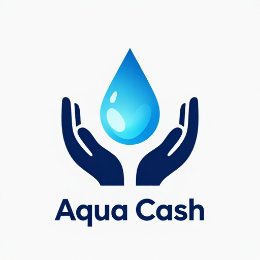

# 💎

  
  <h1>Aqua Cash (AQU) - Official Project Roadmap</h1>

Aqua Cash is a community-driven token built on the Binance Smart Chain (BSC), designed to foster long-term value through liquidity stability and strategic supply management.

### 🔗 Project Links
*   **Token Contract Address:** `0x1ca2fcd10477604f291525c4c65a6b3e7485303`
*   **[📊 View AQU on BscScan](https://bscscan.com/token/0x1ca2fcd10477604f291525c4c65a6b3e7485303)**

---

### 📍 Current Status: Phase 1 (Price Discovery & Liquidity Foundation)
*   ✅ Smart Contract Deployment on BSC.
*   ✅ Initial Liquidity Provision on PancakeSwap.
*   ✅ Establishing core community channels.
### 🔮 Upcoming: Phase 2 (Growth & Ecosystem Expansion)
*   🚀 Community-Led Marketing Campaign.
*   🔒 Implementation of Anti-Whale mechanisms for price stability.
*   🌐 Expanding presence on social media and crypto communities.
*   📈 Preparing for CEX listings and advanced trading features.
